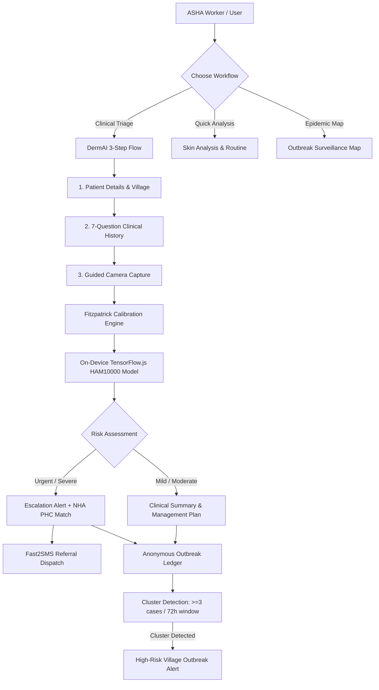

# Luma (DermAI) 🩺✨

> **Offline-First, Fitzpatrick-Calibrated AI Dermatology & Rural Triage System**  
> *Empowering frontline healthcare workers (ASHA / PHCs) and rural communities with 100% on-device clinical screening, multilingual voice guidance, and real-time outbreak surveillance.*

[](https://react.dev/)
[](https://vitejs.dev/)
[](https://tailwindcss.com/)
[](https://www.tensorflow.org/js)
[](https://vitest.dev/)
[](https://web.dev/progressive-web-apps/)
[](LICENSE)

---

## 🌟 Overview

In rural India and underserved low-resource regions, access to certified dermatologists is critically scarce—with less than **1 dermatologist per 100,000 people** outside Tier-1 cities. Furthermore, most existing computer vision dermatology models suffer from significant **fair-skin training bias**, misdiagnosing or under-detecting conditions on darker skin phenotypes (Fitzpatrick Types IV–VI).

**Luma** addresses this critical gap. Built as a high-performance **Progressive Web Application (PWA)**, Luma delivers **100% on-device clinical triage and lesion screening**. It operates seamlessly without requiring internet connectivity, safeguards patient privacy by keeping all images locally in the browser, and equips Accredited Social Health Activists (ASHA) with intelligent triage tools, multilingual voice guidance, and automated Primary Health Centre (PHC) referrals.

---

## ⚡ Core Capabilities & Clinical Innovations

### 1. 🧠 100% On-Device & Offline AI Inference
- **Client-Side TensorFlow.js Engine**: Uses fine-tuned MobileNet/HAM10000 classification models running directly in the browser via WebGL with automatic fallback to CPU/WASM.
- **Zero Cloud Uploads**: Patient lesion imagery is analyzed locally in memory. No clinical photos or personally identifiable health information (PHI) ever leave the device by default.
- **Offline PWA Architecture**: Model weights, UI assets, and client logic are fully cached for standalone use in remote villages with zero cellular reception.

### 2. 🎯 Fitzpatrick Type V & VI Melanin Calibration
- **Combating Algorithmic Bias**: Specialized colorimetric adjustments compensate for erythema masking in melanin-dense skin where redness presents as hyperpigmentation, violaceous hues, or subtle induration rather than typical pink/red flushing.
- **Automatic & Manual Tone Calibration**: Live skin tone sampling combined with manual override capabilities ensures equitable diagnostic confidence across Fitzpatrick scale Types I through VI.

### 3. 🩺 DermAI Guided Rural Triage Workflow
A streamlined, foolproof 3-step operator flow built specifically for community health workers:
1. **Patient Intake**: Fast recording of demographic data and location details.
2. **7-Question Clinical History**: Structured symptom questionnaire (lesion evolution, itch vs. pain, bleeding, previous treatments, family history).
3. **Smart Camera Capture**: Viewport lesion framing with real-time blur detection, glare checking, and lighting validation before capture.

### 4. 🚨 Red Flag & Clinical Escalation Detection
- Flags high-urgency conditions (e.g., Melanoma, Basal Cell Carcinoma, severe Actinic Keratoses) with immediate visual warnings.
- Delivers clinical protocol guidance and emergency instructions tailored for non-physician field operators.

### 5. 🏥 National Health Authority (NHA) HFR & SMS Referrals
- **PHC Resolution**: Integrated directory mapping to NHA Health Facility Registry (HFR) facilities across rural districts.
- **Automated Referral Slips**: Generates structured referral documentation containing case summaries and diagnostic risk ratings.
- **Fast2SMS Dispatch**: Instant dispatch of emergency and appointment referral SMS alerts to patients and local health officers.

### 6. 🗺️ Real-Time Contagious Outbreak Surveillance
- **Epidemiological Cluster Detection**: Built-in 72-hour sliding window algorithm detects clusters (≥ 3 cases) of contagious skin conditions (e.g., Scabies, Tinea/Ringworm, Impetigo) across village corridors.
- **Strict Anonymization**: Only village coordinates, timestamp, Fitzpatrick tone, and condition are logged—strictly zero names, contact details, or PII.

### 7. 🗣️ Multilingual Voice Guidance (Bhashini AI)
- Fully localized voice text-to-speech (TTS) and UI translations for **7 Indian languages**:
  - Hindi (हिन्दी)
  - Marathi (मराठी)
  - Bengali (বাংলা)
  - Tamil (தமிழ்)
  - Telugu (తెలుగు)
  - Gujarati (ગુજરાતી)
  - English
- Designed to overcome literacy barriers during patient consultations.

### 8. 🌿 Skincare Routine & Health Advisory Engine
- Comprehensive consumer-grade routine engine for preventative skincare and barrier repair, tailored for sensitive and tropical climate skin conditions.
- Offline record tracking powered by `localforage` / IndexedDB.

---

## 🏗️ Architecture & Diagnostic Flow



---

## 💻 Tech Stack

| Domain | Technology | Description |
|---|---|---|
| **Frontend Framework** | React 19 + Vite 8 | Ultra-fast client runtime with modern ES module builds |
| **Styling & UI** | Tailwind CSS v4 + Radix UI + Framer Motion | High-performance responsive layouts, micro-animations, and fluid transitions |
| **Icons** | Lucide React | Clean, scalable vector medical and functional iconography |
| **Machine Learning** | TensorFlow.js + MobileNet | Client-side deep learning with WebGL / WASM acceleration |
| **Offline Storage** | LocalForage (IndexedDB) | Robust client-side database caching patient history and telemetry |
| **Voice & Multilingual** | Bhashini AI / Web Speech API | Multi-language voice output across 7 regional Indian languages |
| **External Services** | NHA HFR Registry + Fast2SMS | Health facility resolution and cellular SMS notifications |
| **Testing** | Vitest + React Testing Library + JSDOM | Unit, integration, and memory leak stress testing |

---

## 📂 Project Structure

```text
Luma/
├── public/
│   ├── model/                     # Quantized TensorFlow.js HAM10000 model shards
│   │   ├── model.json
│   │   └── group1-shard*.bin
│   ├── favicon.svg
│   └── icons.svg
├── src/
│   ├── assets/                    # Static branding, images, and vectors
│   ├── components/                # Reusable UI & clinical components
│   │   ├── CameraCapture.jsx      # Lesion capture with blur/lighting check
│   │   ├── DeviceSelectionModal.jsx
│   │   ├── EscalationAlert.jsx    # Emergency clinical referral modal
│   │   ├── Layout.jsx             # Topbar, navigation, and language selector
│   │   ├── ResultsDisplay.jsx     # Clinical prediction & confidence cards
│   │   └── ui/                    # Base primitives (buttons, sliders, blur)
│   ├── contexts/
│   │   └── LanguageContext.jsx    # Multilingual state & Bhashini TTS wrapper
│   ├── lib/                       # Clinical, geographic, and messaging logic
│   │   ├── bhashini.js            # Indian language translation & voice synthesis
│   │   ├── diseaseMap.js          # Village dataset & 72h cluster detection algorithm
│   │   ├── fitzpatrick.js         # Melanin calibration & tone classification
│   │   ├── phc.js                 # NHA Health Facility Registry directory
│   │   ├── sampleLesions.js       # Offline clinical calibration benchmarks
│   │   ├── sms.js                 # Fast2SMS emergency notification client
│   │   └── utils.js               # Formatting and class merging helpers
│   ├── services/
│   │   ├── historyService.js      # LocalForage encrypted client storage
│   │   └── mlService.js           # TensorFlow.js pipeline, memory leak safeguards
│   ├── tests/                     # Vitest test suites (39 tests)
│   │   ├── CameraCapture.test.jsx
│   │   ├── DermAIWorkflow.test.jsx
│   │   ├── EscalationAlert.test.jsx
│   │   ├── History.test.jsx
│   │   ├── ResultsDisplay.test.jsx
│   │   ├── SkinAnalysis.test.jsx
│   │   ├── SkincareEngine.test.jsx
│   │   ├── bhashini.test.js
│   │   ├── diseaseMap.test.js
│   │   ├── fitzpatrick.test.js
│   │   ├── historyService.test.js
│   │   ├── mlService.test.js
│   │   └── phcAndSms.test.js
│   ├── views/                     # Primary application screens
│   │   ├── DermAIWorkflow.jsx     # Guided 3-step rural screening workflow
│   │   ├── DiseaseMap.jsx         # Epidemic cluster detection & map view
│   │   ├── History.jsx            # Local patient consultation history
│   │   ├── Home.jsx               # Immersive landing page & PWA installer
│   │   ├── MobileSkinAnalysis.jsx # Quick mobile camera scan interface
│   │   ├── SkinAnalysis.jsx       # Diagnostic result evaluation view
│   │   └── SkincareEngine.jsx     # Preventative skincare recommendation engine
│   ├── App.jsx                    # Routing & PWA install prompts
│   ├── index.css                  # Tailwind styles and custom design system
│   └── main.jsx                   # Application entry point
├── package.json
├── tailwind.config.js
├── vite.config.js
└── README.md
```

---

## 🚀 Getting Started

### Prerequisites
- [Node.js](https://nodejs.org/) (version **18.0.0** or higher recommended)
- `npm` or `pnpm` or `yarn`

### Installation

1. **Clone the repository**:
   ```bash
   git clone https://github.com/Ansika-Singh/Luma.git
   cd Luma
   ```

2. **Install dependencies**:
   ```bash
   npm install
   ```

3. **Start the local development server**:
   ```bash
   npm run dev
   ```
   Open [http://localhost:5173](http://localhost:5173) in your browser.

4. **Build for production**:
   ```bash
   npm run build
   ```
   The compiled static assets will be created in the `dist/` directory.

5. **Preview production build locally**:
   ```bash
   npm run preview
   ```

---

## 🧪 Testing

Luma includes a comprehensive suite of **39 tests across 13 test suites**, covering component rendering, Fitzpatrick calculations, TensorFlow memory leaks (zero-tensor-leak verification after 20 loops), cluster detection, and offline storage.

To run the automated test suite:

```bash
# Run all tests once
npm test

# Run tests in interactive watch mode
npm run test:watch
```

---

## 🔒 Privacy & Clinical Disclaimer

1. **Privacy By Design**: Luma is engineered to prioritize data privacy. Photographic scans are processed directly within the user's browser runtime and are **never uploaded to external cloud servers**.
2. **Clinical Decision Support**: Luma is designed as an assistive triage aid for community healthcare workers, ASHA volunteers, and educational purposes. It is **not** a replacement for qualified dermatological or histological diagnosis. Urgent conditions flagged by the system must always be referred to a certified medical officer or Primary Health Centre (PHC).

---

## 📄 License

This project is licensed under the [MIT License](LICENSE).
